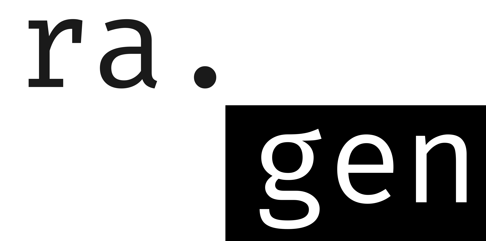

# ragen



A simple tool to generate `rust-project.json` for Rust-Analyzer in VSCode.

If you want to write rust code in non-cargo project, this tool may be useful for you.

## How to use

1. Add ragen to your path  
2. Install Rust-Analyzer extension in VSCode  
3. Open a folder contains `.rs` files with VSCode, run this command in terminal:  

```
ragen .
```

4. Now ragen will listen to the file changes and automatically generate configurations for Rust-Analyzer.